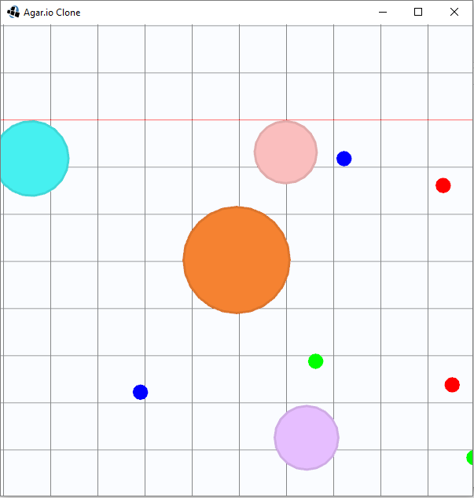

## Simple Agar.io Clone (Colyseus Java Example)
This is an example project to learn how to work with [Colyseus Java Client](https://github.com/doorbash/colyseus-java)
 
**Client: **[Libgdx](https://libgdx.badlogicgames.com/) + [Colyseus client for Java](https://github.com/doorbash/colyseus-java)

**Server: **[Colyseus](https://colyseus.io/)

 

